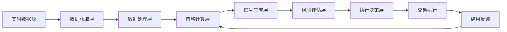

# A股短线二线龙头策略量化系统 V2.1

## 系统概述

基于"闸门-阈值-剧本"框架的可量化、可执行、可复盘的A股短线交易系统。专注于热点板块中的二线龙头股票，通过多层次的量化筛选和风险控制，实现稳健的短线收益。

## 核心特点

- **六步板块轮动验证**：精准捕捉市场热点切换
- **多维度龙头筛选**：一线带动，二线跟随
- **量化风险控制**：三闸门净期望评估体系
- **实时监控预警**：分时硬指标校验
- **自动化执行**：买卖剧本预设，情绪熔断机制

## 系统架构

```
trading-system/
├── backend/                    # 后端服务
│   ├── app.py                 # Flask主应用
│   ├── config/                # 配置管理
│   │   ├── __init__.py
│   │   ├── settings.py        # 系统配置
│   │   └── thresholds.yaml    # 策略阈值配置
│   ├── core/                  # 核心策略引擎
│   │   ├── __init__.py
│   │   ├── macro_filter.py    # 宏观环境过滤器
│   │   ├── sector_rotation.py # 板块轮动分析
│   │   ├── stock_selector.py  # 龙头股票筛选
│   │   ├── entry_signals.py   # 买点信号生成
│   │   ├── risk_manager.py    # 风险管理器
│   │   └── executor.py        # 交易执行器
│   ├── data/                  # 数据处理
│   │   ├── __init__.py
│   │   ├── fetcher.py         # 数据获取（akshare）
│   │   ├── processor.py       # 数据处理
│   │   ├── cache.py           # 数据缓存
│   │   └── realtime.py        # 实时数据流
│   ├── analysis/              # 分析模块
│   │   ├── __init__.py
│   │   ├── technical.py       # 技术指标计算
│   │   ├── capital_flow.py    # 资金流向分析
│   │   ├── sentiment.py       # 市场情绪分析
│   │   └── correlation.py     # 相关性分析
│   ├── backtest/              # 回测引擎
│   │   ├── __init__.py
│   │   ├── engine.py          # 回测核心引擎
│   │   ├── metrics.py         # 性能指标计算
│   │   └── optimizer.py       # 参数优化器
│   ├── api/                   # API接口
│   │   ├── __init__.py
│   │   ├── routes.py          # 路由定义
│   │   ├── websocket.py       # WebSocket实时推送
│   │   └── auth.py            # 认证授权
│   ├── utils/                 # 工具函数
│   │   ├── __init__.py
│   │   ├── logger.py          # 日志管理
│   │   ├── helpers.py         # 辅助函数
│   │   └── validators.py      # 数据验证
│   └── tests/                 # 单元测试
│       ├── test_macro.py
│       ├── test_rotation.py
│       └── test_signals.py
│
├── frontend/                   # 前端界面
│   ├── index.html             # 主页面
│   ├── css/
│   │   ├── style.css          # 主样式
│   │   └── components.css     # 组件样式
│   ├── js/
│   │   ├── app.js             # 主应用逻辑
│   │   ├── dashboard.js       # 仪表板
│   │   ├── charts.js          # 图表组件
│   │   ├── websocket.js       # WebSocket连接
│   │   └── utils.js           # 工具函数
│   └── assets/                # 静态资源
│       ├── images/
│       └── fonts/
│
├── database/                   # 数据库
│   ├── init.sql               # 数据库初始化
│   ├── schema.sql             # 表结构定义
│   └── migrations/            # 数据库迁移
│
├── logs/                      # 日志文件
│   ├── system.log             # 系统日志
│   ├── trading.log            # 交易日志
│   ├── error.log              # 错误日志
│   └── backtest.log           # 回测日志
│
├── data/                      # 数据存储
│   ├── market/                # 市场数据
│   ├── stocks/                # 个股数据
│   ├── cache/                 # 缓存数据
│   └── export/                # 导出数据
│
├── scripts/                   # 脚本工具
│   ├── manage.sh              # 系统管理脚本
│   ├── deploy.sh              # 部署脚本
│   ├── backup.sh              # 备份脚本
│   └── monitor.py             # 监控脚本
│
├── config/                    # 配置文件
│   ├── production.env         # 生产环境配置
│   ├── development.env        # 开发环境配置
│   └── docker-compose.yml     # Docker配置
│
├── docs/                      # 文档
│   ├── strategy.md            # 策略说明
│   ├── api.md                 # API文档
│   └── deployment.md          # 部署指南
│
├── requirements.txt           # Python依赖
├── package.json              # 前端依赖
├── .env.example              # 环境变量示例
├── .gitignore                # Git忽略文件
└── README.md                 # 项目说明
```

## 核心模块功能

### 1. 宏观环境过滤器 (macro_filter.py)
- **硬条件检测**：VIX指数、全球市场、A50夜盘
- **软条件评估**：大盘趋势、市场广度、北向资金
- **动态阈值调整**：根据市场状态自适应
- **预备仓位机制**：渐进式建仓策略

### 2. 板块轮动分析 (sector_rotation.py)
- **六步验证流程**：
  1. 强弱对比：新旧热点排名变化
  2. 板块广度：上涨占比与换手率
  3. 时间延续：连续性验证
  4. 资金比例：流入流出对比
  5. 主力背书：龙虎榜与北向验证
  6. 隐形资金：ETF申赎与股通变动
- **衰退阈值监控**：第3日成交额预警
- **逻辑链评分**：板块相关性分析

### 3. 龙头股票筛选 (stock_selector.py)
- **一线龙头确认**：涨停先锋、成交额领先
- **二线龙头筛选**：
  - 成交额排名3-8位
  - 市值100-800亿区间
  - PE分层控制
  - 资金痕迹验证
  - 时序RS指标

### 4. 买点信号生成 (entry_signals.py)
- **四类买点识别**：
  - 突破买：放量突破平台
  - 回踩买：缩量回踩确认
  - 趋势延续：均线多头排列
  - 反包转强：首阴反包
- **分时硬指标**：
  - 量占比分析
  - OBV一致性
  - 15分钟结构
  - 1分钟异常过滤

### 5. 风险管理器 (risk_manager.py)
- **三闸门评估**：
  - RR风险回报比 ≥2.0
  - Pwin胜率 ≥0.60
  - EV_net净期望 ≥+0.6%
- **仓位控制**：
  - 单笔风险0.5-1.0%
  - 总敞口≤30-50%
  - 动态止损机制
- **熔断机制**：
  - 单日-2%停手
  - 月度-5%休整
  - 情绪分数监控

### 6. 交易执行器 (executor.py)
- **自动化下单**：API对接券商系统
- **卖出剧本执行**：分批止盈止损
- **时间管理**：T+2/T+3/T+5规则
- **跌停应对**：应急处理机制

## 数据流程



## 快速开始

### 环境要求
- Python 3.8+
- Node.js 14+
- MySQL 8.0+ 或 PostgreSQL 12+
- Redis 6.0+ (可选，用于缓存)

### 安装步骤

1. **克隆项目**
```bash
git clone https://github.com/yourusername/trading-system.git
cd trading-system
```

2. **安装Python依赖**
```bash
pip install -r requirements.txt
```

3. **安装前端依赖**
```bash
cd frontend
npm install
cd ..
```

4. **配置环境变量**
```bash
cp .env.example .env
# 编辑 .env 文件，填入你的配置
```

5. **初始化数据库**
```bash
mysql -u root -p < database/init.sql
mysql -u root -p trading_system < database/schema.sql
```

6. **启动系统**
```bash
./scripts/manage.sh start
```

## 使用说明

### 启动服务
```bash
# 启动全部服务
./scripts/manage.sh start

# 启动后端服务
./scripts/manage.sh start backend

# 启动前端服务
./scripts/manage.sh start frontend

# 查看状态
./scripts/manage.sh status

# 查看日志
./scripts/manage.sh logs

# 停止服务
./scripts/manage.sh stop
```

### 访问界面
- 主界面：http://localhost:8080
- API文档：http://localhost:5000/api/docs
- 监控面板：http://localhost:8080/monitor

## 策略参数配置

主要参数配置文件：`backend/config/thresholds.yaml`

```yaml
# 宏观过滤条件
macro:
  hard_conditions:
    vix_max: 25
    global_futures_min: -1.5
  soft_conditions:
    ma_period: 50
    breadth_min: 55
    northbound_min: 50

# 板块轮动
rotation:
  rank_change_min: 5
  breadth_min: 60
  time_continuation: 2
  capital_ratio: 0.5

# 风险管理
risk:
  single_risk_pct: 0.01
  total_exposure_max: 0.3
  stop_loss_atr: 1.0
  daily_loss_limit: -0.02
  monthly_drawdown_limit: -0.05

# 期望值闸门
expectation:
  rr_min: 2.0
  pwin_min: 0.60
  ev_net_min: 0.006
```

## 回测功能

```python
# 运行回测
python -m backend.backtest.engine \
    --start-date 2023-01-01 \
    --end-date 2024-12-31 \
    --initial-capital 1000000 \
    --strategy second-line-leader
```

## 性能指标

系统目标性能：
- **夏普比率**: > 1.0
- **最大回撤**: < 15%
- **月胜率**: > 60%
- **平均盈亏比**: > 2.0

## API接口示例

### 获取宏观环境状态
```http
GET /api/v1/macro/status
```

### 获取板块轮动分析
```http
GET /api/v1/sectors/rotation
```

### 获取龙头股票列表
```http
GET /api/v1/stocks/leaders?sector=AI&type=second-line
```

### 提交交易信号
```http
POST /api/v1/trades/signal
{
  "symbol": "002415",
  "action": "BUY",
  "quantity": 1000,
  "price": 52.30
}
```

## 监控与告警

系统提供多层次监控：
- **系统监控**：CPU、内存、磁盘使用率
- **数据监控**：数据延迟、缺失率
- **策略监控**：信号触发、执行偏差
- **风险监控**：仓位、回撤、止损触发

告警通道：
- 邮件通知
- 微信推送
- 钉钉机器人
- 系统日志

## 开发指南

### 添加新策略
1. 在 `backend/core/` 创建策略文件
2. 继承 `BaseStrategy` 类
3. 实现必要的方法
4. 在配置中注册策略

### 扩展数据源
1. 在 `backend/data/` 添加数据源适配器
2. 实现统一的数据接口
3. 更新数据获取逻辑

## 注意事项

1. **风险提醒**：本系统仅供研究学习，实盘交易需谨慎
2. **数据延迟**：免费数据源可能存在15分钟延迟
3. **监管合规**：请遵守相关法律法规
4. **资金安全**：建议先进行模拟交易验证

## 技术栈

- **后端**：Python, Flask, SQLAlchemy, Celery
- **前端**：HTML5, CSS3, JavaScript, WebSocket
- **数据库**：MySQL/PostgreSQL, Redis
- **数据源**：akshare, tushare, 东方财富
- **部署**：Docker, Nginx, Supervisor

## 更新日志

### V2.1.2 (2025-08-20)
- 优化宏观过滤器软条件
- 增加预备仓位机制
- 改进板块轮动识别
- 修复分时异常检测bug

### V2.1.1 (2025-08-19)
- 添加ETF资金流监控
- 优化二线龙头时序窗口
- 增强风险熔断机制

### V2.1.0 (2025-08-19)
- 策略框架全面升级
- 新增六步板块轮动验证
- 实现三闸门期望评估

## 贡献指南

欢迎提交Issue和Pull Request。请确保：
1. 代码符合PEP8规范
2. 包含完整的单元测试
3. 更新相关文档

## 许可证

MIT License

## 联系方式

- 问题反馈：[GitHub Issues](https://github.com/EvanLee85/short_second_strategy/issues)
- 技术交流：trading-system@example.com

## 免责声明

本系统仅供学习研究使用，不构成投资建议。使用者需自行承担投资风险，开发者不对任何投资损失负责。# short_second_strategy
